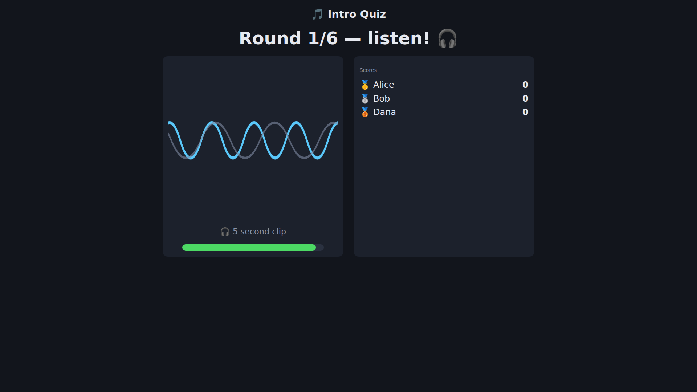
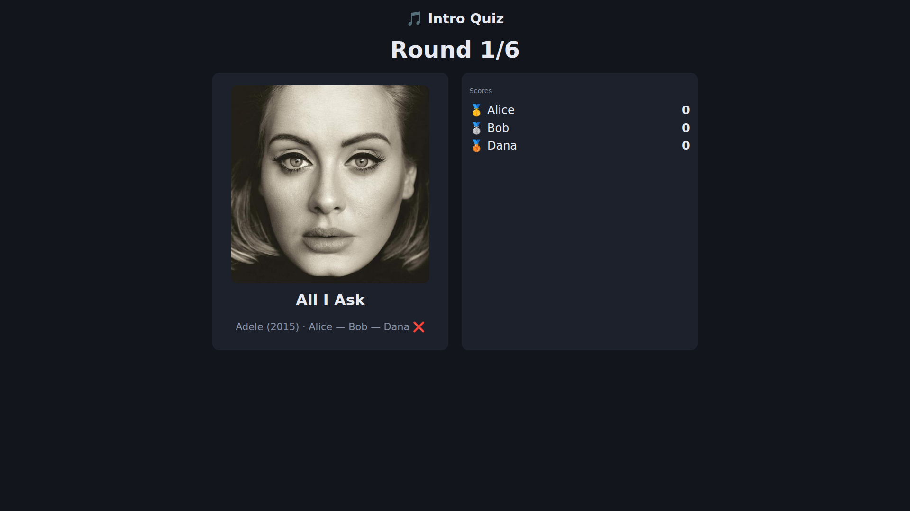
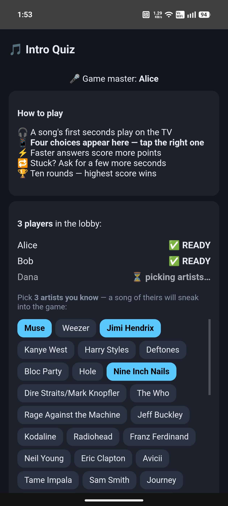
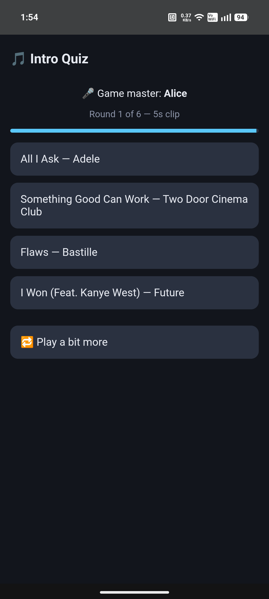
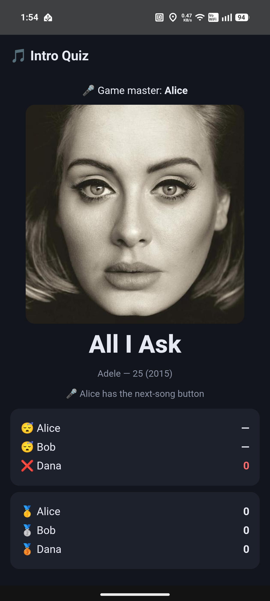
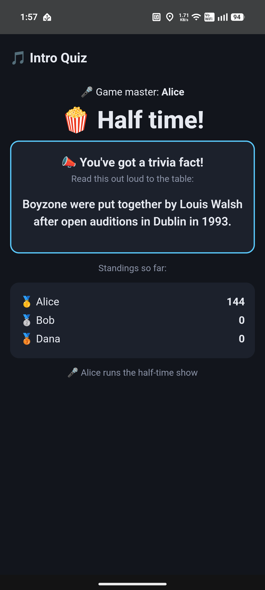
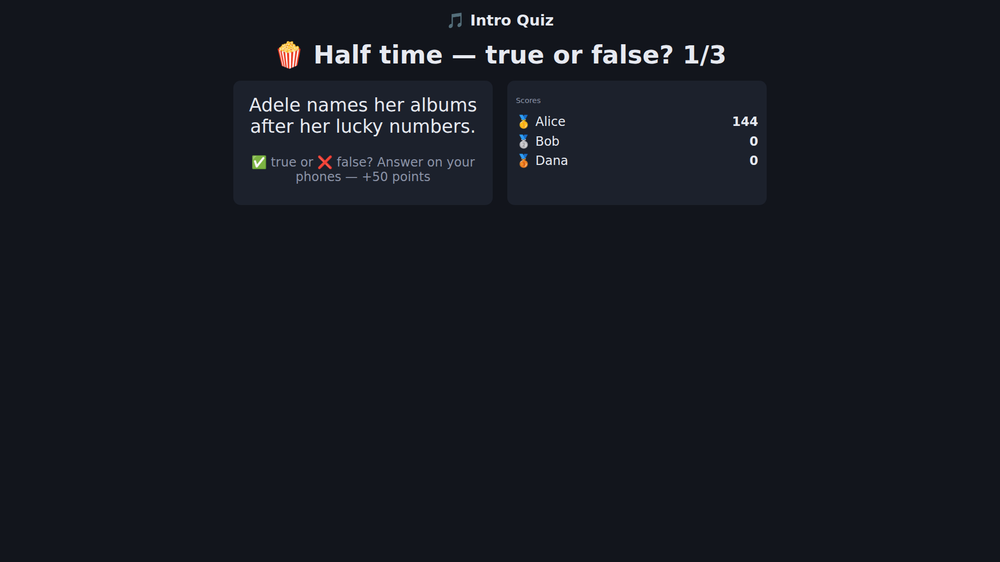

# Intro Quiz

Self-hosted "guess the intro" music quiz for family game night, built on your own
[Navidrome](https://www.navidrome.org/) library. A song's **first 5 seconds** play
and everyone races to name it on their phones — fastest correct answer scores most.
Runs on a **cast display or Android TV** (scoreboard + album art + audio on the big
screen), or **just as happily on a cast speaker** — no scoreboard, phones carry the
questions, the speaker carries the music. All local — your music, your network, no
subscriptions.

> ### 🔒 Your library is read-only to this app
> The quiz **never writes to your music files or your Navidrome library — ever.**
> It connects with a dedicated **non-admin** Subsonic login, never sees your
> filesystem, and cuts its clips from *streamed* audio into its own folder.
> Tags, files, playlists and play counts in your library are never created,
> modified or deleted by any code in this repository. The mis-tag detector
> *reports* suspect titles; fixing them is always yours to do, with your own
> tools, if you choose to.

  

  

  
  
  
  

## How a game works

1. Everyone opens the app on their phone (a plain LAN web page) and joins with a name.
   Whoever started the game is the **game master** — only their phone gets the
   start / next-song / half-time controls. A 🎤 banner on every phone shows who's
   in charge, and **the master's chair rotates each game**: the final screen
   announces who runs the next one (if they're not playing, anyone can take over
   from the lobby).
2. While waiting in the lobby, each player **picks 3 artists they know** from a wall
   of your library's most popular artists (freshly randomised each game) — one song
   per player's picks is shuffled invisibly into the rounds, so guests and kids
   aren't slaughtered by the host's record collection. The game won't start until
   everyone's locked in or skipped.
3. Each round: a clip plays on the TV (an animated wave with a live progress bar —
   no spoilers), four choices appear on the phones (decoys from the same era, never
   the same artist twice), 20-second window, speed bonus, early reveal when everyone
   has answered. Phones buzz at each round start; a round nobody answered replays
   once before revealing.
4. Stuck? Anyone can extend the clip (5 → 10 → 20 seconds).
5. The reveal shows album art and **who got it right** while a "payoff" chunk of
   the song plays — **in full**: the next-song button stays locked with a countdown
   until the music finishes. No skipping the good bit.
6. At the midpoint, the game breaks for a **half-time show**: every player's phone gets a music
   fact to read out to the table, then three quick **true-or-false** questions —
   answered on the phones, question up on the TV, +50 points each on the main
   scoreboard, auto-revealed once everyone's in.
7. Rubbish clip (applause intro, ambient noise)? The game master's reveal screen has
   a **🚫 bad clip** link — two taps to confirm — that bans the track forever.
8. Ten rounds a game, a 🎺 fanfare on the final scores, persistent all-time
   leaderboard.

  

## How it works under the hood

- **Library sync** — walks your whole Navidrome library over the Subsonic API into
  SQLite (tracks, artists, durations).
- **Recognisability scoring** — two signals per track: *family* (Navidrome play
  counts + stars) and *global* (Last.fm listeners via `track.getInfo`). Blended into
  difficulty tiers: your favourites are "easy"; world-famous songs you own but never
  play are "medium" — the sweet spot where everyone has a chance.
- **Clip cutting** — a background job downloads originals and cuts loudness-normalised
  MP3 clips with ffmpeg (5/10/20s intros + a payoff from ~40% in), working through the
  library in global-popularity order. **Silence-aware**: if a track opens with a long
  quiet stretch (rain, feedback, ambience — looking at you, metal and post-rock), the
  intro clips start where the audible song does (`silencedetect`, capped at 60s; re-cut
  existing tracks via `POST /api/clips/recut?q=%pattern%`). **ID3 tags are stripped and
  re-titled** so a display's now-playing overlay can't leak the answer. Tracks over 12 minutes (DJ
  mixes) are excluded (tunable via `MAX_DURATION_S`, seconds); whole albums can be banned by pattern (`POST /api/ban/album`).
  Undecodable originals retry via the music server's transcode before being banned,
  and a stream that returns an error document (stale index after files were renamed)
  is recognised rather than fed to ffmpeg.
- **The game engine** — one websocket hub (FastAPI), phases lobby → question → reveal.
  Rounds are built lazily at first start so artist picks land first. Answer timing is
  server-side; the correct answer never ships to clients before the reveal.
- **The TV board** — a second web page cast to the display via DashCast
  (pychromecast). The board **plays the round audio itself** through the Web Audio API
  (one audio context for the whole game) — casting clips as media would evict the
  scoreboard, because a cast device runs one app at a time. Audio is served from an
  anonymous per-round endpoint so phones can't extract the track id mid-round. Android
  TV (e.g. Nvidia Shield) autoplays; touch displays (Nest Hub) need one tap to unlock
  sound — the board shows an overlay asking for it.
- **Half-time trivia** — a curated seed pack ships in the repo (~180 read-aloud music
  facts + ~215 true/false questions, **deliberately Irish/UK-centric** — Eurovision,
  Thin Lizzy and Westlife feature) and lives in SQLite; the true/false pool tops
  itself up from [Open Trivia DB](https://opentdb.com/) whenever it runs low
  (`POST /api/trivia/topup`, also called automatically at game start). Picks prefer
  never-used items and recycle oldest-first, so repeats take months. Answers never
  ship to phones before the reveal. Not your region? See
  [Make your own trivia pack](#make-your-own-trivia-pack) below.
- **Speaker-only mode** — pick "no scoreboard" at game start and clips cast to a
  speaker via Home Assistant + Music Assistant instead; the phones do the rest.
  A display isn't required to play.
- **Upkeep** — schedule the four maintenance endpoints nightly with whatever you
  like (cron, systemd timer): `POST /api/sync`, `/api/score/lastfm`,
  `/api/score/tiers`, `/api/clips/cut` — the library re-syncs, new tracks get
  scored, tiered and clipped. Optionally add `POST /api/quality/check` as a fifth
  step to get told when new tracks look mis-tagged (see Notes). Clips cost ~2 MB per track.

## Run

**You need:** a [Navidrome](https://www.navidrome.org/) server, Docker, a free
[Last.fm API key](https://www.last.fm/api) — and **at least one audio output**:
a cast display / Android TV, **or** Home Assistant + Music Assistant for a
speaker. With neither, the game is silent and unplayable — the clips have to
play *somewhere*. (Running outside Docker? Python 3.12+ and ffmpeg required.)

    docker compose up -d --build

Prefer not to build? Pre-built multi-arch (amd64/arm64) images are published on each
release — `docker compose pull && docker compose up -d` grabs them from
`ghcr.io/colfin22/intro-quiz` (also on [Docker Hub](https://hub.docker.com/r/colfin22/intro-quiz)).

Copy [`.env.example`](.env.example) to `.env` and fill in the required values — the file
is self-documenting and grouped into required / audio-output / optional. You'll set a
Navidrome server + a **non-admin** user, your Last.fm key, and at least one audio output.

> **⚠️ Casting's `BOARD_URL` has two hard prerequisites — get these wrong and nothing casts.**
> 1. **A valid HTTPS cert on a real domain.** Cast displays and Nest speakers **silently
>    refuse** plain HTTP or self-signed certs — so the board must be served over TLS with
>    a trusted cert, even though everything runs on your own LAN.
> 2. **The domain must resolve on *public* DNS.** Google Cast devices **hard-code Google's
>    DNS (8.8.8.8)** and ignore your router/Pi-hole, so a purely-internal name won't work —
>    it has to resolve externally (pointed at your LAN IP is fine).
>
> You don't have to expose the app to the internet for either. Full walkthrough, including
> a no-open-ports method: **[docs/https-lan.md](docs/https-lan.md)**.

Then run the one-time setup (from the machine running the container; use the host's IP
instead of `localhost` if you're on another computer):

    curl -X POST http://localhost:8000/api/bootstrap

This does everything in one call — sync, Last.fm scoring, difficulty tiers, then clip
cutting — in the background. Clip cutting is the long part (**hours** on a big library,
bottlenecked on the Navidrome download), so leave it running; rerun the command if it
stops and it picks up where it left off. It's ready when `http://localhost:8000/health`
shows `"ready_to_play": true` — then phones open `http://localhost:8000` to join and the
board is at `/board`.

That's the whole happy path. For the rest — ongoing clip-cutting, running the setup
stages individually, Navidrome user permissions, clip storage and sizing, and Windows —
see **[docs/setup.md](docs/setup.md)**.

## Make your own trivia pack

The shipped half-time pack is Irish/UK-centric. To localise it, drop a
`trivia_custom.json` beside `quiz.db` (default `./data/`) — a flat JSON list of
`{"kind":"fact","text":...}` and `{"kind":"tf","text":...,"answer":1|0}` items,
seeded automatically at the next game start. Full format, rules and a copy-paste
**LLM prompt** for drafting a regional pack: **[docs/trivia-pack.md](docs/trivia-pack.md)**.

## Notes

- Navidrome play counts are per-user; the family score aggregates the `annotation`
  table exported from Navidrome's DB and posted to `POST /api/ingest/annotations`
  (rows of `{"id", "play_count", "starred"}` summed across your users).
- Tests: `python -m pytest tests/` (includes a node-based smoke that renders every
  phone-UI phase — a thrown render fails CI instead of shipping a half-drawn screen).
- The all-time leaderboard can be wiped with `POST /api/leaderboard/reset?confirm=yes`.
- **Mis-tag detection:** junk in a track's *subtitle* tag ("Teenage Kicks (PMEDIA)")
  breaks Last.fm matching, so the track scores zero and never gets picked.
  `GET /api/quality` lists tracks scoring ~no listeners while their artist is clearly
  popular — the tell-tale of a mangled title. `POST /api/quality/check` re-runs it and,
  if `HA_URL`/`HA_TOKEN`/`HA_NOTIFY_SERVICE` are set, pushes new suspects to your phone
  via Home Assistant (`HA_NOTIFY_SERVICE` is your notify action, e.g.
  `notify.mobile_app_<device>`); otherwise just read `/api/quality`. Baseline once after
  install with `?push=false` so only future misses alert. Fix = clean the tags, rescan,
  re-sync (`POST /api/bootstrap`).

## Roadmap

Planned:

- **Hear more after the reveal** — once everyone's guessed, optionally play a longer snippet or the whole song, with playback controls to keep it going ([#44](https://github.com/colfin22/intro-quiz/issues/44)).

Recently shipped:

- **Pre-built Docker images** — multi-arch (amd64/arm64) images published to `ghcr.io/colfin22/intro-quiz` and Docker Hub on every release, so you can `docker compose pull` instead of building from source ([#33](https://github.com/colfin22/intro-quiz/issues/33)).
- **Rock-solid casting** — fixed the mid-game board crashes on Chromecast/Shield. Clip audio is rebuilt on a single Web Audio context (a fresh `<audio>` per clip was exhausting the receiver's decoder), and a stray between-games quit no longer interrupts back-to-back games. No setup change — the same DashCast casting, now stable ([#32](https://github.com/colfin22/intro-quiz/issues/32), [#47](https://github.com/colfin22/intro-quiz/issues/47)).

## Licence

Built by Colm Finn — [MIT licensed](LICENSE).
